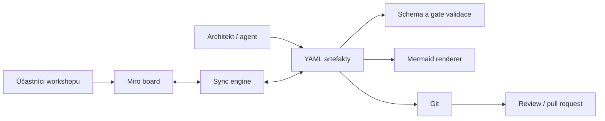

# Architektura produktu DDDA

## 1. Účel a hranice produktu

DDDA koordinuje doménové discovery, strategický a taktický DDD návrh, socio-technické rozhodování a přípravu implementace. Nejde o CASE nástroj, náhradu architekta ani generátor mikroservis. Produkt poskytuje konzistentní pracovní tok, strukturované artefakty, vizuální scaffoldy, validaci a dohledatelnost rozhodnutí.

## 2. Architektonické cíle

Prioritní quality attributes:

| Quality attribute | Požadavek | Architektonický mechanismus |
|---|---|---|
| Konzistence | Stejný pojem a artefakt nesmí mít nekontrolovaně různé reprezentace | stabilní `artifact_id`, YAML schémata, explicitní konflikty |
| Auditovatelnost | Musí být dohledatelné kdo, kdy a proč změnu provedl | Git historie, zdroj artefaktu, validační záznam |
| Modifikovatelnost | Musí být možné přidávat typy projektů, artefaktů a scaffoldů | deklarativní YAML, verze schémat, adaptéry |
| Přenositelnost | Model nesmí být uzamčen v Miru | YAML jako kanonický sémantický formát, Mermaid export |
| Spolupráce | Workshop musí být snadný pro business i IT | Miro-first interakce, české instrukce, legendy a facilitační kroky |
| Izolace projektů | Projekty nesmí sdílet stav ani artefakty bez explicitního odkazu | samostatný adresář, manifest, board a namespace ID |
| Bezpečnost | Tokeny a citlivé podklady nesmí být commitovány | environment variables, `.gitignore`, omezené scope tokenů |

## 3. Logické komponenty

### 3.1 Workspace Registry

Eviduje projekty v jedné instalaci. Každý projekt má:

- stabilní `project_id`,
- typ projektu,
- vlastní Miro board nebo explicitně přidělenou board area,
- vlastní adresář artefaktů,
- vlastní synchronizační stav,
- vlastní gates a rozhodnutí.

Registry neobsahuje doménová data projektů; pouze odkazy a provozní metadata.

### 3.2 Project Workspace

Izolovaná jednotka práce. Obsahuje manifest, vstupy, artefakty, Mermaid výstupy, ADR, synchronizační stav a audit. Projekt může používat sdílené šablony, ale nesmí přímo měnit artefakty jiného projektu.

### 3.3 Artifact Model

Kanonická sémantická reprezentace. Každý spravovaný artefakt obsahuje minimálně:

```yaml
artifact_id: bc-policy-administration
artifact_type: bounded_context
schema_version: 1.0.0
project_id: life-insurance-greenfield
stage: define
status: validated
name: Správa pojistných smluv
source:
  kind: workshop
  references:
    - miro:board-id/frame-id
ownership:
  business_owner: Head of Policy Operations
  team: policy-team
revision:
  git_commit: null
  miro_modified_at: null
```

### 3.4 Miro Scaffold Renderer

Z deklarativní definice vytváří:

- navigační osu metodického toku,
- frame pro jednotlivé fáze,
- legendy a instrukce,
- pracovní plochy pro workshop,
- gate checklisty,
- metadata pro synchronizaci.

Renderer nesmí do scaffoldů zakódovat konkrétní doménové závěry.

### 3.5 Synchronization Engine

Porovnává sémantický stav YAML s objekty v Miru. Rozlišuje:

- sémantická pole,
- vizuální pole,
- lokální workshopové poznámky,
- odvozené výstupy.

Nevyřešený souběžný konflikt se nikdy automaticky nepřepisuje. Vznikne conflict record k lidskému rozhodnutí.

### 3.6 Mermaid Renderer

Generuje textové pohledy pro:

- context map,
- lifecycle/state diagram,
- team topology,
- zjednodušený EventStorming flow,
- integrační pohled.

Mermaid je odvozený výstup; ruční změny generovaného souboru se nepovažují za změnu zdrojového modelu.

### 3.7 Validation and Gate Engine

Provádí dvě úrovně kontroly:

1. **strukturální validaci** proti JSON Schema,
2. **metodickou validaci** podle gate kritérií.

Gate není automatické tvrzení, že je model správný. Potvrzuje, že existuje dostatečný a explicitně validovaný podklad pro další krok.

## 4. Tok dat



## 5. Vlastnictví dat

| Druh informace | Zdroj pravdy | Poznámka |
|---|---|---|
| Název, význam, vztahy a stav artefaktu | YAML | sémantická data |
| Pozice, velikost, barva a seskupení | Miro | vizuální data |
| Historie změn | Git | audit a review |
| Ad-hoc poznámky během workshopu | Miro | po triage se povyšují do YAML nebo zahodí |
| Mermaid diagram | generovaný soubor | nepřepisovat ručně |
| Rozhodnutí o konfliktu | conflict record + Git commit | explicitní lidská volba |

## 6. Rozšiřitelnost

Nový artefakt vyžaduje:

1. definici typu a povinných polí,
2. JSON Schema,
3. mapování na Miro widgety,
4. pravidla synchronizace,
5. případný Mermaid renderer,
6. metodické umístění a gate pravidla,
7. kuchařku nebo rozšíření existující kuchařky.

Nový typ projektu vyžaduje profil workflow, povinné a volitelné fáze, gate pravidla, doporučené vstupy, rizika a aliases.

## 7. Bezpečnost a provoz

- Miro token se načítá pouze z prostředí nebo bezpečného secret store.
- Doporučené scope jsou nejmenší možné pro čtení a zápis konkrétních boardů.
- Vstupní dokumenty mohou obsahovat citlivá data; projekt určuje klasifikaci a pravidla ukládání.
- Log synchronizace nesmí obsahovat tokeny ani celé citlivé texty.
- Automatizace musí podporovat dry-run.

## 8. Architektonická omezení

- Miro API a jeho datový model se mohou měnit; integrace musí být adaptér za interním kontraktem.
- Absolutní vizuální shoda Miro a Mermaid není cílem.
- Automatická inference bounded contexts, agregátů nebo invariantů je návrh k validaci, nikoli autoritativní rozhodnutí.
- Živá synchronizace vyžaduje konkrétní Miro aplikaci, autentizaci a webhook/polling provozní konfiguraci.
