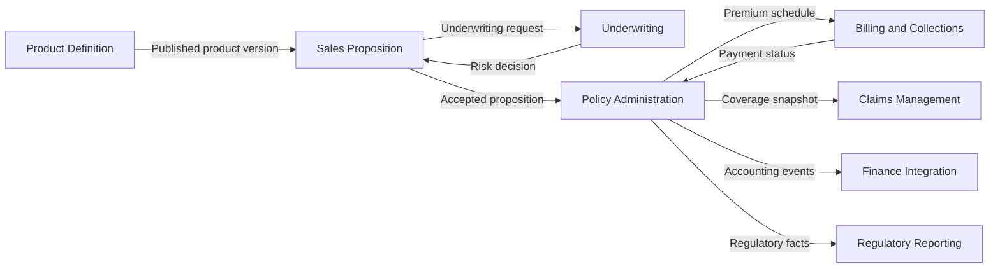

# Referenční projekt — Greenfield životní pojišťovna

## 1. Scénář

Skupina zakládá digitální životní pojišťovnu pro český a slovenský trh. Cílem není pouze nový policy administration system, ale provozní model celé pojišťovny: distribuce, underwriting, správa smluv, inkaso, pojistné události, zákaznická obsluha, finance, compliance a reporting.

Projekt demonstruje profil `greenfield-portfolio` a průchod od Align po implementační hand-off.

## 2. Business cíle

- uvést první rizikové životní pojištění do 12 měsíců,
- umožnit produktovým týmům měnit underwriting pravidla bez plošného release core systému,
- zajistit auditovatelnost rozhodnutí a regulatorní reporting,
- podporovat přímý i zprostředkovatelský distribuční kanál,
- oddělit diferenciující schopnosti od generic SaaS/COTS capability.

## 3. Předpoklady

- zdravotní data mají vysokou citlivost,
- platby, účetnictví, identita a e-signature mohou být koupené capability,
- underwriting a návrh produktu jsou kandidáti Core Domain,
- cílový systém musí podporovat postupné přidávání produktů,
- konkrétní technologie nejsou v discovery předurčeny.

## 4. Vstupy

```text
inputs/
├── business-plan.md
├── target-operating-model.md
├── regulatory-requirements.md
├── product-concept-term-life.md
├── distribution-journeys.md
├── underwriting-guidelines.md
└── vendor-capability-catalog.md
```

Každý vstup má v katalogu ownera, datum, citlivost, důvěryhodnost a části relevantní pro projekt.

## 5. Krok za krokem

### Krok 1 — Align

Prompt pro agenta:

> Analyzuj vstupy projektu životní pojišťovny. Odděl fakta, předpoklady a otevřené otázky. Navrhni business problém, cíle, scope/out-of-scope, stakeholder mapu a prioritní quality attribute scénáře. Nenavrhuj technologie ani bounded contexts.

Očekávaný výstup:

- scope: od návrhu produktu a nabídky po vznik, servis a ukončení smlouvy a likvidaci plnění,
- out-of-scope první inkrement: skupinové životní pojištění a investiční složka,
- quality attributes: auditovatelnost, privacy, modifikovatelnost pravidel, dostupnost distribučního journey, recoverability plateb.

Gate G1 schvaluje sponsor, Chief Product Officer a Chief Architect.

### Krok 2 — Big Picture EventStorming

Workshop začíná událostmi například:

- ProduktNavržen,
- ProduktSchválen,
- ZájemceIdentifikován,
- PotřebyZákazníkaZjištěny,
- NabídkaVytvořena,
- ZdravotníDotazníkVyplněn,
- RizikoVyhodnoceno,
- NabídkaPřijata,
- SmlouvaUzavřena,
- PrvníPojistnéPřijato,
- PojistnáOchranaAktivována,
- ZměnaSmlouvyProvedena,
- PojistnáUdálostNahlášena,
- NárokPosouzen,
- PlněníVyplaceno,
- SmlouvaUkončena.

Hotspoty:

- Kdy přesně vzniká pojistná ochrana?
- Kdo vlastní klientská kontaktní data?
- Je zdravotní posouzení součást nabídky, nebo samostatný model?
- Jak se rozlišuje návrh produktu od jeho prodejní varianty?
- Co je autoritativní stav platby při výpadku poskytovatele?

Observed lifecycles:

- nabídka,
- underwriting case,
- pojistná smlouva,
- premium receivable,
- claim.

### Krok 3 — Process Modeling

Prioritní scénář: sjednání rizikového životního pojištění.

```text
Zájemce
→ Požádat o nabídku
→ Zachytit potřeby a souhlasy
→ Vyhodnotit distribuční vhodnost
→ Vytvořit nabídku
→ Vyžádat zdravotní informace
→ Vyhodnotit riziko
→ Upravit nebo potvrdit podmínky
→ Přijmout nabídku
→ Podepsat smlouvu
→ Přijmout první pojistné
→ Aktivovat pojistnou ochranu
```

Process Modeling odhalí, že distributor, underwriting a policy administration používají pojem „nabídka“ odlišně.

### Krok 4 — Decompose

Kandidátní subdomény:

| Subdoména | Pracovní typ | Důvod |
|---|---|---|
| Product Design | Core | rychlost a kvalita produktových změn |
| Underwriting | Core | diferenciující risk selection a pravidla |
| Distribution Journey | Core/Supporting | diferenciace digitální distribuce; závisí na strategii |
| Policy Administration | Supporting | kritická, ale převážně standardní capability |
| Claims | Supporting/Core candidate | potenciální diferenciace v customer experience a automatizaci |
| Billing and Collections | Generic/Supporting | možnost platformy nebo produktu |
| Customer Identity and Consent | Generic with strict constraints | regulace, citlivost a enterprise reuse |
| Finance and General Ledger | Generic | typicky koupená capability |
| Regulatory Reporting | Supporting | lokální regulatorní znalost |

Candidate lifecycle underwriting case je oddělen od lifecycle nabídky, protože má jiné rozhodování, citlivá data a ownership.

### Krok 5 — Strategize

Portfolio rozhodnutí:

- build: Product Design a Underwriting Decisioning,
- build/partner: Distribution Journey,
- buy/configure: General Ledger, e-signature, payments,
- evaluate COTS: Policy Administration,
- vlastní ACL a canonical contracts kolem vendor produktů.

### Krok 6 — Connect

Kandidátní bounded contexts:

- Product Definition,
- Sales Proposition,
- Underwriting,
- Policy Administration,
- Billing and Collections,
- Claims Management,
- Customer and Consent,
- Distribution Partner Management,
- Finance Integration,
- Regulatory Reporting.

Příklad vztahů:



Data ownership:

- Product Definition vlastní verzovaný produktový model.
- Underwriting vlastní underwriting case a risk decision.
- Policy Administration vlastní pojistnou smlouvu a business stav ochrany.
- Billing vlastní pohledávku, inkaso a reconcile s payment providerem.
- Customer and Consent vlastní identitu, kontaktní preference a souhlasy; ostatní kontexty používají účelové snapshoty.

### Krok 7 — Organize

První cílové týmy:

- Product and Underwriting stream-aligned team,
- Sales Journey stream-aligned team,
- Policy Lifecycle stream-aligned team,
- Claims stream-aligned team,
- Insurance Platform team pro společné technické capability a paved road,
- dočasný enabling team pro DDD, security/privacy a event/API contract design.

Platform team nevlastní business bounded contexts ostatních týmů. Enabling team nevytváří permanentní delivery závislost.

### Krok 8 — Define

Prioritní bounded context: Underwriting.

Design-Level ES:

```text
Underwriter / automatická policy
→ Vyhodnotit riziko
→ UnderwritingCase
→ musí existovat platná produktová verze, souhlasy a dostatečné evidence
→ RizikoVyhodnoceno
→ policy: pokud je potřeba doplnění
→ VyžádatDoplňujícíInformace
→ DoplňujícíInformaceVyžádány
→ po doplnění znovu VyhodnotitRiziko
→ RiskDecision projection pro Sales Proposition
```

Candidate agregáty/consistency boundaries:

- `UnderwritingCase` chrání stav posouzení a vazbu na immutable evidence references,
- produktový model se nekopíruje jako mutable objekt; používá se konkrétní published version,
- zdravotní dokumenty mohou být vlastněny separátní secure evidence capability a v Underwritingu jsou pouze reference a odvozená fakta.

Validovaný lifecycle:

```text
Opened → EvidencePending → ReadyForAssessment → Assessed
       → Referred → Assessed
       → Declined | OfferedWithTerms | AcceptedStandard
```

### Krok 9 — Code hand-off

První vertical slice:

- digitální žádost,
- jednoduchý rules-based underwriting pro produkt s limitem,
- accepted standard decision,
- předání přijaté nabídky do Policy Administration,
- audit trail a základní observabilita.

Nevstupuje do prvního slice:

- komplexní manual underwriting workbench,
- claims,
- skupinové produkty,
- univerzální enterprise event bus.

## 6. Výsledná adresářová mapa

```text
artifacts/
├── align/
│   ├── discovery-brief.yaml
│   └── quality-attributes.yaml
├── discover/
│   ├── events.yaml
│   ├── glossary.yaml
│   ├── hotspots.yaml
│   └── lifecycles-observed.yaml
├── decompose/
│   ├── candidate-subdomains.yaml
│   └── candidate-lifecycles.yaml
├── strategize/
│   └── subdomain-strategy.yaml
├── connect/
│   ├── bounded-contexts.yaml
│   ├── context-map.yaml
│   └── data-ownership.yaml
├── organize/
│   └── team-topology.yaml
├── define/
│   ├── underwriting-context-canvas.yaml
│   ├── underwriting-design-level-es.yaml
│   ├── underwriting-lifecycle.yaml
│   └── underwriting-invariants.yaml
└── code/
    └── slice-01-standard-underwriting.yaml
```

## 7. Co příklad záměrně netvrdí

- že každý bounded context musí být samostatná mikroservisa,
- že doménové události znamenají Event Sourcing,
- že všechny uvedené hranice jsou univerzální pro každou pojišťovnu,
- že koupený policy administration produkt nepotřebuje doménový model na straně pojišťovny,
- že team topology je konečná organizační struktura.

Příklad je metodický referenční model a musí být přizpůsoben konkrétní strategii, regulaci, distribučnímu modelu a sourcingu.